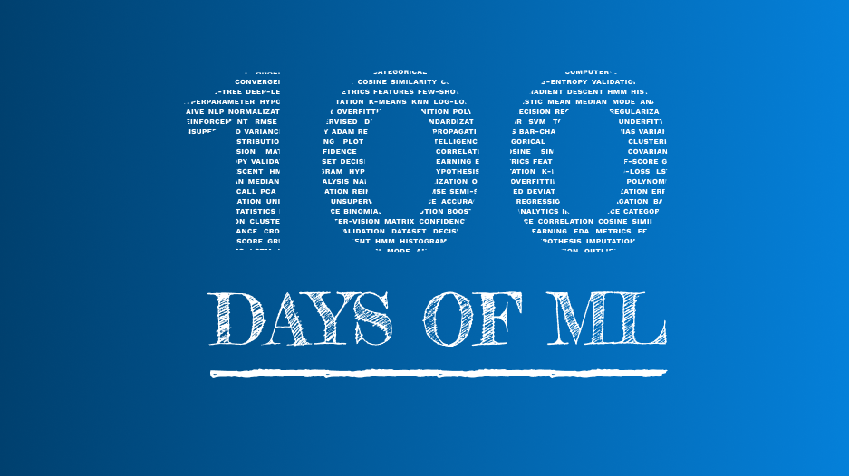

  

  

# 100 Days Of ML Challenge  
During these difficult times, don’t give up. Learn something new or brush up your skills. For the same, I [Kabir Nagpal](https://www.linkedin.com/in/kabir-nagpal-3a1302174), have decided to encourage Machine Learning amongst everyone.

## Motivation for 100 Days of ML 

There was and has always been an image of the future fueled by technology at the core. Today, technology advancement has happened so fast, thanks to the new kid on the block called Machine Learning.   
The motive of this initiative is to bring together individuals who have a will to do something and a passion for knowledge and help them and each other to grow knowledge in Machine Learning.  
This is a **call to action, a battle cry, a spark** that will light a movement to radically improve the state of humanity. 100+ Days of ML Code is a commitment to better your understanding of this powerful tool by dedicating at least 1 hour of your time every day to studying and/or coding machine learning for at-least 100 days.  

*Just an year ago, I was totally new to the field and this became a motivation for me as well, to thrive excellence in this domain.*

## Eligibility for joining the group

Everyone is eligible, even people who've never coded before and are ready to strive, on an awesome journey of learning and contributing, starting now. Professionals with experience in similar domains are also most welcome to join us, share experience and resources as well or collaborate.

## Pledge while joining the group
- To dedicate at least one hour everyday towards coding and/or studying Machine Learning.

- To write about my progress (with the *#100DaysOfMLCode* hashtag).

- When applicable, will post all relevant codes to a repository publicly available over GitHub or in a Google Colaboratory Notebook so that others can get helped too !!

At the outset, it is useful to clarify the interests within the field and the goals which we want to achieve by engaging with the Telegram Group.

## Goals after joining the group

At the end of this 100+ Days Of ML Code journey, all the members will be able to showcase a rich portfolio of code, analysis and narrative, treating all the above topics and models plus all the additional content, that as a member you will invariably experience throughout this learning journey.

You will also be encouraged to explain and demonstrate (at a reasonably granular level) the mathematical machinery underpinning machine learning.

Finally — you will be contributing to the plethora of existing resources aimed at encouraging others toward engaging with machine learning.

Your aim throughout this process will be to critically engage with freely accessible materials while always being sure to provide useful links for others to grow together.
**Thereby accept 100+ Days of ML Code Challenge!**
We wish you the Best and the community is always there to help you.

## How to join the community ?

To join click [here](https://t.me/ml_code_for_100_days)

